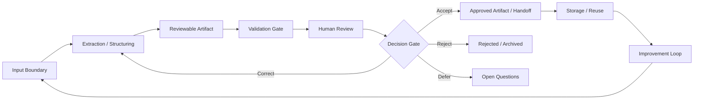

# Black Signal Lab Artifact Lifecycle

## Purpose

This document describes how messy inputs become reviewable artifacts in controlled AI-assisted work.

It is aligned with `METHOD_PRINCIPLES.md` and the Black Signal Governance Model.

It is not an implementation workflow, software design, or product roadmap. It describes the lifecycle discipline that keeps AI-assisted work inspectable, bounded, and accountable.

## Core Lifecycle

```text
input -> extraction -> artifact -> validation -> review -> decision -> storage -> improvement loop
```

The lifecycle can be lightweight or formal, depending on risk and consequence.

The important point is not ceremony.

The important point is that the output does not silently move from generated text to trusted work.

## Lifecycle Diagram



## Stage 1: Input Boundary

The lifecycle begins before AI produces anything.

The input boundary defines what material may be used, what must be excluded, and what sensitivity constraints apply.

A useful input boundary states:

- source type,
- source owner or origin,
- intended use,
- sensitivity level,
- allowed context,
- excluded context,
- public/private constraints,
- known gaps,
- expected output type.

If the input boundary is unclear, the output will be difficult to trust later.

## Stage 2: Extraction / Structuring

Extraction turns messy material into candidate structure.

This may include:

- summarizing source material,
- identifying claims,
- separating facts from interpretations,
- extracting risks,
- listing decisions,
- finding assumptions,
- identifying open questions,
- grouping actions or dependencies.

At this stage, output is not yet reliable.

It is only structured review material.

## Stage 3: Reviewable Artifact

The structured output becomes useful only when it is captured as an artifact.

An artifact should be stable enough to inspect, correct, reject, reuse, or hand off.

Examples:

- source profile,
- evidence map,
- decision log,
- validation result,
- handoff note,
- interpretation report,
- task contract,
- review checklist,
- status report,
- artifact lifecycle note.

A reviewable artifact should state:

- purpose,
- input used,
- output summary,
- key claims,
- assumptions,
- gaps,
- review status,
- owner or reviewer,
- next intended use.

## Stage 4: Validation Gate

A validation gate checks whether the artifact is ready for human review.

Validation may check:

- required fields,
- completeness,
- internal consistency,
- boundary compliance,
- source references,
- missing sections,
- unsupported claims,
- public-safety constraints,
- scope drift.

Validation does not make the artifact true.

Validation only answers whether the artifact is structured enough and bounded enough to review.

## Stage 5: Human Review

Human review is where responsibility returns to a person or authorized group.

The reviewer checks whether the artifact is useful, safe, accurate enough, bounded, and appropriate for its intended use.

Human review may result in:

- acceptance,
- correction,
- rejection,
- escalation,
- deferral,
- request for more evidence,
- change of scope,
- decision to store only as draft material.

The reviewer is not rubber-stamping the model.

The reviewer is deciding what the artifact is allowed to mean.

## Stage 6: Decision Gate

The decision gate separates review material from approved action.

A decision gate should ask:

- Is this artifact accepted?
- Who accepts it?
- What is approved?
- What remains uncertain?
- What may be reused?
- What may be published?
- What should be corrected first?
- What should be rejected or archived?
- What consequence is someone accepting?

The decision gate may produce one of four outcomes:

```text
accept -> approved artifact or handoff
correct -> return to extraction / artifact revision
reject -> stop use and archive if useful
 defer -> keep open questions visible
```

## Stage 7: Storage / Handoff

Accepted artifacts should be stored or handed off with their status intact.

Storage should preserve:

- artifact name,
- version or date,
- source boundary,
- review status,
- reviewer or owner,
- decision outcome,
- known limitations,
- next use,
- related artifacts.

A stored artifact should not lose its context.

If an artifact is only draft material, it should remain labeled as draft material.

If an artifact is approved, the approval boundary should be clear.

## Stage 8: Improvement Loop

The lifecycle should improve the method, not only produce artifacts.

After use, review what happened:

- Which inputs were unclear?
- Which artifacts were useful?
- Which validation checks failed?
- Which assumptions caused rework?
- Which review questions repeated?
- Which boundaries were missing?
- Which artifact should become a reusable template?
- Which artifact should be retired?

The improvement loop turns repeated friction into better structure.

That is how the method becomes sharper without becoming heavier.

## Review Points

Review does not happen only once.

There are several review points in the lifecycle:

| Point | Review Question | Reviewer Focus |
| --- | --- | --- |
| Input boundary | Is the source allowed and sufficient? | scope, sensitivity, exclusions |
| Extraction | Did the model separate facts, interpretations, and assumptions? | structure, categories, gaps |
| Artifact | Is the output inspectable? | purpose, format, status |
| Validation | Is the artifact ready for human review? | completeness, consistency, boundary checks |
| Human review | Can this be accepted, corrected, rejected, or escalated? | judgment, risk, usability |
| Decision gate | What is approved and who accepts consequence? | authority, responsibility, next use |
| Storage | Will future readers understand the artifact status? | traceability, version, limits |
| Improvement loop | What should change in the method? | reuse, pruning, better gates |

## Decision Gate Model

The decision gate is the most important control point.

Without a decision gate, AI-assisted work can drift from draft to action without accountability.

Use this minimal decision model:

```text
Artifact status:
- draft
- review material
- validated for review
- accepted
- rejected
- deferred
- archived

Decision outcome:
- approve for use
- approve with corrections
- return for revision
- reject
- defer pending evidence
- store as reference only
```

The decision gate must be human-owned.

AI may prepare the material. It does not accept the consequence.

## Storage Rules

Storage is not dumping output into a folder.

Storage is preserving the artifact with enough context that a future reader can understand its status.

Minimum storage metadata:

- artifact title,
- artifact type,
- date or version,
- input boundary,
- review state,
- decision state,
- owner or reviewer,
- known limitations,
- related artifacts,
- permitted next use.

If the artifact cannot carry that context, it should not become a source of truth.

## Improvement Loop Rules

The improvement loop should be small and practical.

Do not create a new process for every problem.

Instead, look for recurring failures:

- repeated missing input,
- repeated unsupported claims,
- repeated review confusion,
- repeated boundary issues,
- repeated handoff ambiguity,
- repeated overclaiming,
- repeated storage problems.

When a pattern repeats, improve one of these:

- input boundary,
- artifact template,
- validation checklist,
- review question,
- decision gate,
- storage rule,
- public/private boundary note.

The goal is sharper work, not heavier ritual.

## Lightweight vs Formal Use

Not every AI-assisted output requires the full lifecycle in a heavy form.

Use a lightweight lifecycle when:

- output is private,
- consequence is low,
- no one else will rely on it,
- the artifact will not be reused,
- no public or organizational decision depends on it.

Use a formal lifecycle when:

- output may influence a decision,
- output may become a record,
- output may be handed to another person,
- output may be published,
- output contains sensitive context,
- output may affect process, governance, risk, or accountability.

The higher the consequence, the more visible the lifecycle should be.

## Case Study Variant: SAMAEL

In SAMAEL, the lifecycle appears as governed task execution.

```text
task context -> task contract -> agent-assisted execution -> validation gate -> human review -> approved handoff -> repository/task update -> rule improvement
```

Typical artifacts:

- task contract,
- project memory note,
- execution summary,
- validation gate result,
- handoff note,
- completion record.

Primary risk:

- agent output being treated as completed work before human review.

Important gate:

- human approval before commit, publication, deployment, or external action.

## Case Study Variant: The Daltons

In The Daltons, the lifecycle appears as evidence-backed meeting and document analysis.

```text
source material -> source profile -> extraction -> structured JSON artifacts -> validation -> human review -> approved record / action handoff -> method improvement
```

Typical artifacts:

- material source profile,
- evidence map,
- decision log,
- open questions,
- stakeholder map,
- risk/opportunity map,
- validation result,
- handoff note.

Primary risk:

- a fluent summary becoming a false record of what was decided.

Important gate:

- human review before anything becomes an approved record, management note, or follow-up action.

## Case Study Variant: NOESIS

In NOESIS, the lifecycle appears as telemetry and interpretation governance.

```text
system signal -> event contract -> telemetry record -> interpretation report -> observability gate -> human review -> status / escalation / storage -> signal model improvement
```

Typical artifacts:

- event contract,
- telemetry record,
- interpretation report,
- observability gate,
- human-readable status report,
- review note.

Primary risk:

- derived interpretation being mistaken for authoritative system state.

Important gate:

- human review before escalation, status confirmation, or operational conclusion.

## Public/Private Boundary

The artifact lifecycle must preserve the public/private boundary.

Public artifacts may describe:

- method,
- structure,
- synthetic examples,
- sanitized examples,
- general workflow patterns,
- public-safe review questions,
- public-safe diagrams.

Public artifacts must not include:

- personal data,
- company confidential data,
- real meeting transcripts,
- real project documents,
- real task logs,
- real runtime logs,
- private paths,
- internal URLs,
- credentials, tokens, or secrets,
- production configuration,
- copied internal project files.

The public artifact may show the method.

It must not expose the private machinery.

## Minimum Lifecycle Checklist

Before using or handing off an AI-assisted artifact, check:

- Is the input boundary clear?
- Is the artifact type clear?
- Are facts separated from interpretations?
- Are assumptions visible?
- Are open questions visible?
- Is evidence traceable enough for review?
- Has validation checked structure and boundaries?
- Has a human reviewed it?
- Is the decision status explicit?
- Is storage or handoff allowed?
- Are limitations preserved?
- Is there anything to improve in the method?

If the answer to several of these questions is unclear, the artifact is not ready for trusted use.

## Relationship to Method Principles

The lifecycle operationalizes the method principles:

- Artifact Principle: output must become inspectable work.
- Review Principle: output remains provisional until reviewed.
- Evidence Principle: claims remain connected to support.
- Human Decision Principle: decisions remain human-owned.
- Boundary Principle: inputs and handoffs remain contained.
- Anti-Overclaim Principle: artifact status must not be overstated.

The principles define the discipline.

The lifecycle shows the movement.
