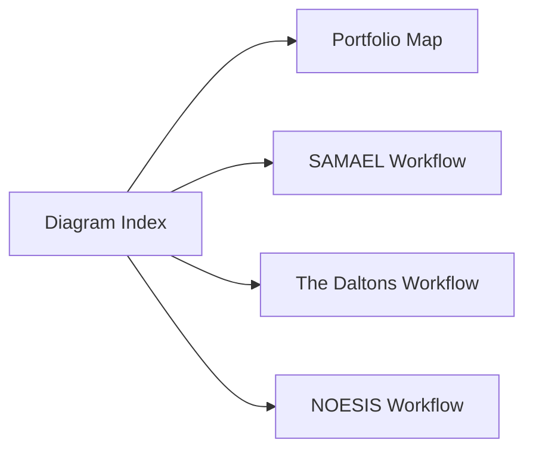

# Diagrams

This directory contains public-safe Mermaid diagrams for the Black Signal Lab portfolio. The diagrams are high-level governance views, not implementation diagrams.

## Index

- [Black Signal Lab portfolio map](black-signal-lab-map.md)
- [SAMAEL workflow](samael-workflow.md)
- [The Daltons workflow](the-daltons-workflow.md)
- [NOESIS workflow](noesis-workflow.md)

## Data Boundary

These diagrams use only public, synthetic, anonymized, or fully sanitized concepts. They do not include personal data, company confidential data, real meeting transcripts, real project documents, real runtime logs, internal URLs, private paths, credentials, tokens, secrets, private infrastructure details, private account names, local paths, production configuration, or copied internal project files.

## What This Demonstrates

The diagram set gives recruiters, hiring managers, and technical reviewers a quick visual path through the portfolio: shared governance themes first, then the individual workflow models behind each case study.
