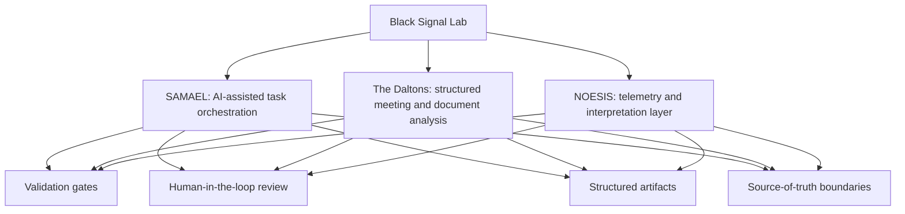

# Black Signal Lab Portfolio Map

This public-safe diagram shows how the three case studies relate to the shared portfolio themes: validation gates, human-in-the-loop review, structured artifacts, and source-of-truth boundaries.

## What This Demonstrates

The portfolio is organized around governance and operating-model patterns rather than isolated tools. Each case study shows a different way to make AI-assisted or system-supported work more explicit, reviewable, and bounded.
