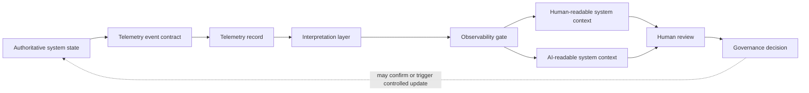

# NOESIS Workflow

This public-safe diagram shows NOESIS as a governance-oriented observability model. It separates authoritative system state from telemetry, interpretation, and human-readable or AI-readable context.

## What This Demonstrates

NOESIS demonstrates how telemetry and structured signals can support interpretation without replacing the source of truth. Observability gates help keep reporting bounded, reviewable, and suitable for both human review and AI-assisted system context.
