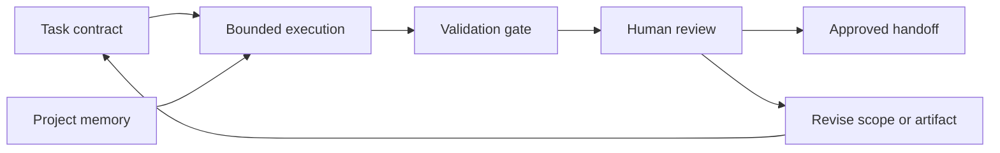

# SAMAEL Workflow

This public-safe diagram shows SAMAEL as a bounded AI-assisted workflow: the task is defined before execution, context is managed through project memory, and human review remains the approval point.

## What This Demonstrates

SAMAEL demonstrates AI-assisted task orchestration with explicit boundaries: task contracts define the work, project memory preserves context, validation gates check readiness, and the approved handoff remains subject to human judgment.
