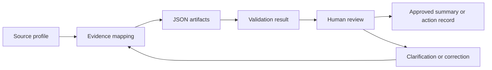

# The Daltons Workflow

This public-safe diagram shows The Daltons as a structured analysis workflow for meeting or document material. It emphasizes evidence mapping, JSON artifacts, validation gates, and reviewable outputs.

## What This Demonstrates

The Daltons demonstrates how unstructured inputs can become structured artifacts without treating model output as final truth. Evidence mapping and validation results make the output easier to inspect before a human approves any summary or action record.
